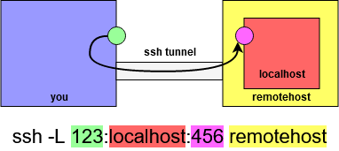
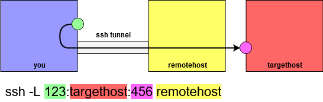
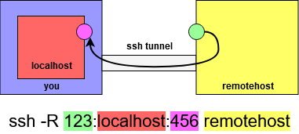
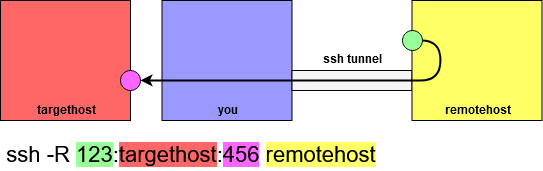

# Pivoting
## Metasploit
With meterpreter session on dual homed machine
```shell
portfwd add -l 4445 -p 4443 -r 10.10.10.10
```
- `-R` for reverse

## SSH Tunneling
From within SSH session `~C` to access options, otherwise restructure as `ssh [TUNNELING COMMANDS] user@10.10.10.10`

### Local forwarding
```shell
-L [LOCAL PORT]:[TARGET IP]:[REMOTE PORT]
```
- Forwards a local port to a remote `ip:port`




- see references

### Remote forwarding
```shell
-R [REMOTE PORT]:[TARGET IP]:[TARGET PORT]
```
- Forwards a remote port to a `ip:port` reachable by you (may be `localhost`)





### SSH from remote to local machine
If you don't have an SSH session, create an SSH session with your machine
- Create local user
```shell
useradd -M pentest  # no home directory
usermod -L pentest  # lock account
usermod -s /bin/false pentest  # set shell to /bin/false
service ssh start
```
- Open SSH session from remote host 
```shell
ssh -R [REMOTE PORT]:[TARGET IP]:[KALI PORT] pentest@10.10.10.10
```

## Plink (PuTTY Link)
Locally
```shell
service ssh start
```
- Transfer `/usr/share/windows-binaries/plink.exe` to target

Remotely
```shell
plink.exe [SSH IP] -P 22 -C -N -L [LOCAL PORT]:[TARGET IP]:[REMOTE PORT] -l user -pw pass  # Local
plink.exe [SSH IP] -P 22 -C -N -R [REMOTE PORT]:[TARGET IP]:[TARGET PORT] -l user -pw pass  # Remote
```

## SOCAT (Linux)
On dual-homed host
```shell
./socat TCP4-LISTEN:[LOCAL PORT],fork TCP4:[TARGET IP]:[TARGET PORT]
```
- Forwards `localhost:[LOCAL PORT]` to `[TARGET IP]:[TARGET PORT]`

## Chisel


# References
- <https://raw.githubusercontent.com/21y4d/Notes/master/Pivoting.txt>
- <https://www.bogotobogo.com/Linux/linux_Secure_Shell_SSH_V_ssh_Reverse_SSH_Tunnel_Remote_Port_Forwarding.php>
    - All credit for SSH tunelling diagrams goes here; they are simply too good to pass up